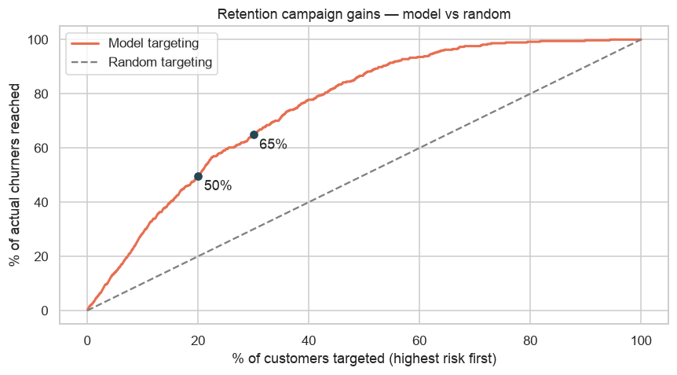
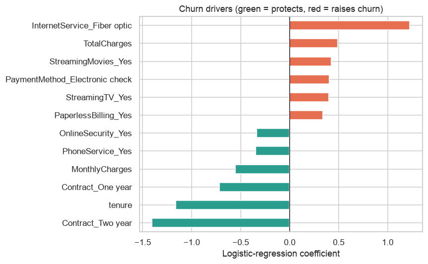

# 📉 Customer Churn Prediction — Real Telco Data


Predicting which customers are about to **churn** (cancel) so a retention team can intervene *before* they leave — and explaining *why* each customer is at risk.

Built on the real **[Telco Customer Churn](https://www.kaggle.com/datasets/blastchar/telco-customer-churn)** dataset — **7,043 real customers, 26.5% churn**. (Telecom is the canonical churn benchmark; the approach transfers directly to banking, SaaS and any subscription business.)

> **Behavioural angle:** churn is disengagement made measurable. Contract choices, tenure, and service usage encode intent to leave long before the customer acts on it.

---

## 📊 Results (held-out test set)

| Model | Churn recall | Churn precision | ROC-AUC | PR-AUC |
|-------|-------------:|----------------:|--------:|-------:|
| **Logistic Regression (balanced)** | **0.78** | 0.50 | **0.842** | 0.633 |
| XGBoost (`scale_pos_weight`) | 0.76 | 0.52 | 0.839 | **0.657** |
| Random Forest (balanced) | 0.66 | 0.56 | 0.827 | 0.618 |

**5-fold CV ROC-AUC (Logistic Regression): 0.845 ± 0.013** — stable.

### ⚠️ The accuracy trap (a deliberate modelling choice)
73.5% of customers *don't* churn, so a model that predicts "nobody churns" scores **73.5% accuracy and is useless**. This project therefore optimises **recall and ROC-AUC**, not accuracy.

### 💡 Business impact — the retention campaign


Rank customers by predicted risk and target the **top 20% → reach ~50% of everyone who will actually churn** (top 30% → ~65%), versus the 20–30% a blind campaign reaches.

### Why customers churn (interpretable drivers)


Two-year contracts and longer tenure **protect** against churn; fiber-optic internet, electronic-check payment, paperless billing and month-to-month contracts **raise** it. A tree-based **SHAP** analysis (in the notebook) independently agrees.

---

## 🧪 Methodology
1. **Cleaning** — `TotalCharges` is stored as text with 11 blanks (tenure-0 new customers → £0); drop `customerID`; encode target ([`src/churn_features.py`](src/churn_features.py)).
2. **EDA** — churn concentrates in month-to-month, short-tenure, high-monthly-charge customers.
3. **Feature prep** — one-hot encoding (~30 features), standardised numerics (scaled inside the split to avoid leakage).
4. **Imbalance handling** — `class_weight='balanced'` / `scale_pos_weight` for the 26.5% minority.
5. **Model comparison** — Logistic Regression vs Random Forest vs XGBoost, judged on recall / ROC-AUC / PR-AUC; 5-fold stratified CV.
6. **Explainability** — LogReg coefficients + XGBoost SHAP (they agree).
7. **Business evaluation** — cumulative-gains ("lift") curve for a retention campaign.

## 🧰 Tech Stack
Python · pandas · NumPy · scikit-learn · XGBoost · SHAP · Matplotlib · Seaborn

---

## 📁 Repository Structure
```
├── README.md
├── requirements.txt
├── notebooks/
│   └── bank_customer_churn.ipynb    # full pipeline with embedded outputs & charts
├── src/
│   └── churn_features.py            # reusable cleaning + feature prep
├── data/                            # download instructions — see data/README.md
├── images/                          # exported charts
└── docs/
```

## 🚀 How to Run
```bash
git clone https://github.com/kndukuba17-hub/Customer-Churn-Prediction.git
cd Customer-Churn-Prediction
pip install -r requirements.txt
# download telco_churn.csv into data/ (see data/README.md), then:
jupyter notebook notebooks/bank_customer_churn.ipynb
```
Runs on Jupyter or Google Colab.

## 🗺️ Roadmap
- Cost-based threshold optimisation (offer cost vs. lost-customer value).
- Uplift modelling — target the *persuadable*, not just the at-risk.
- Streamlit tool: score a customer and display their top churn drivers.

---
### 🎤 Interview talking points
- *"74% accuracy — is that good?"* No — it's a trap; 73.5% is the majority baseline. I optimise recall (0.78) and ROC-AUC (0.84).
- *"Why Logistic Regression over XGBoost?"* Equal ROC-AUC but transparent — coefficients *are* the churn drivers; SHAP on XGBoost confirms them.
- *"How would you act on it?"* Rank by risk, target the top 20% to reach ~50% of churners; set the threshold from retention economics.
